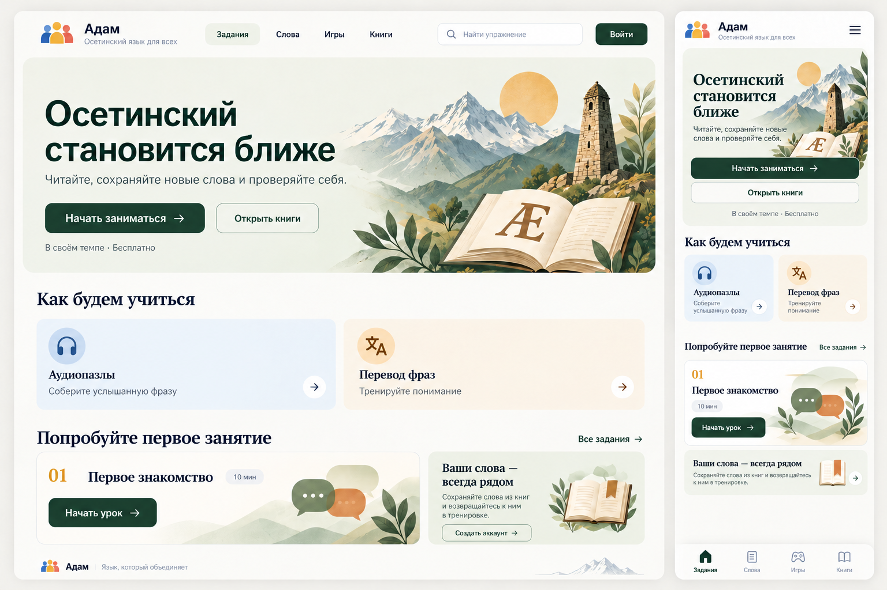
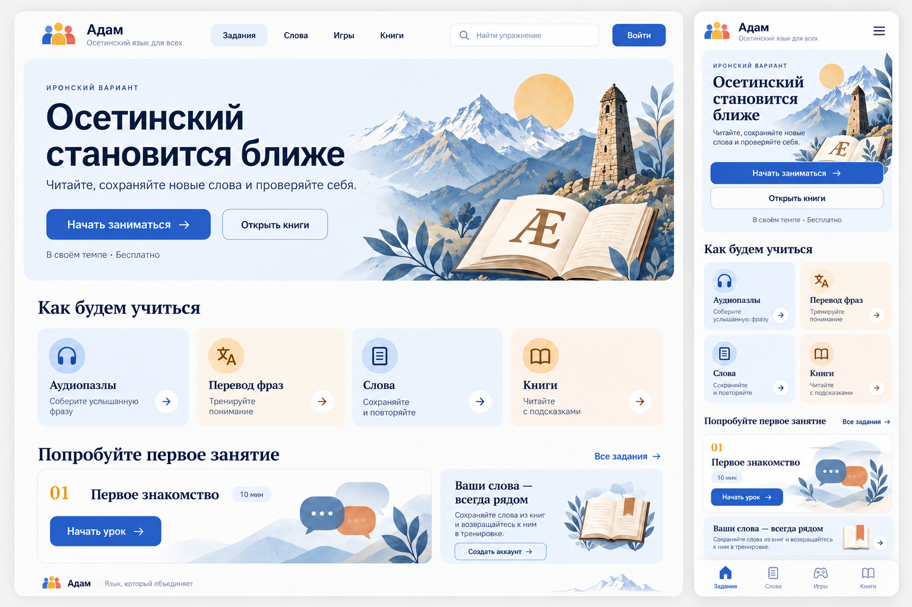
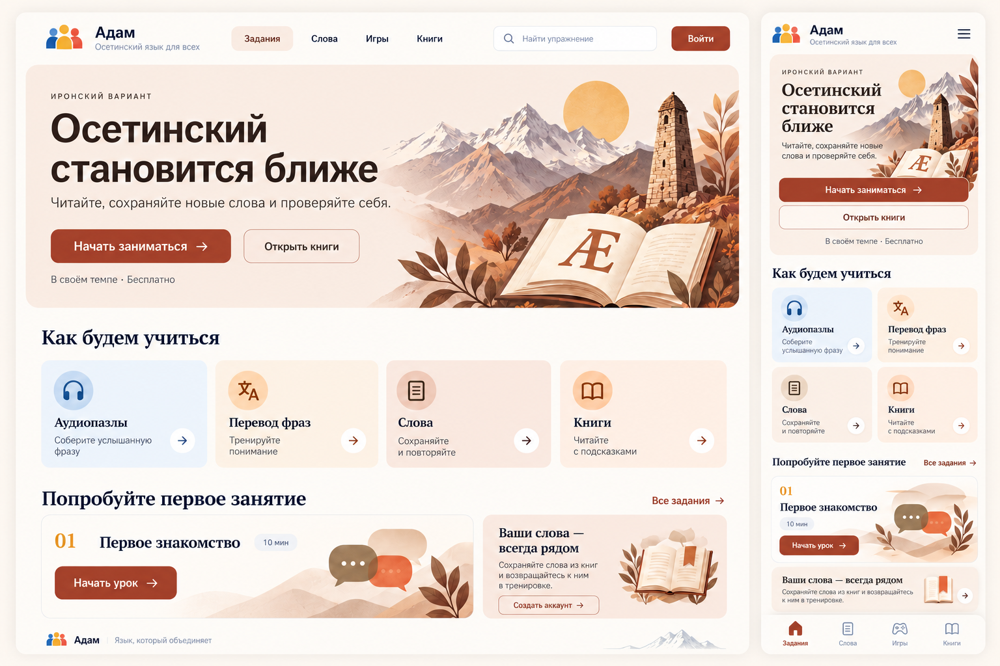
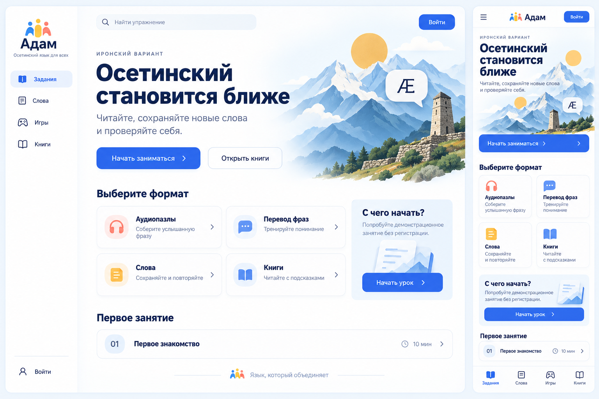
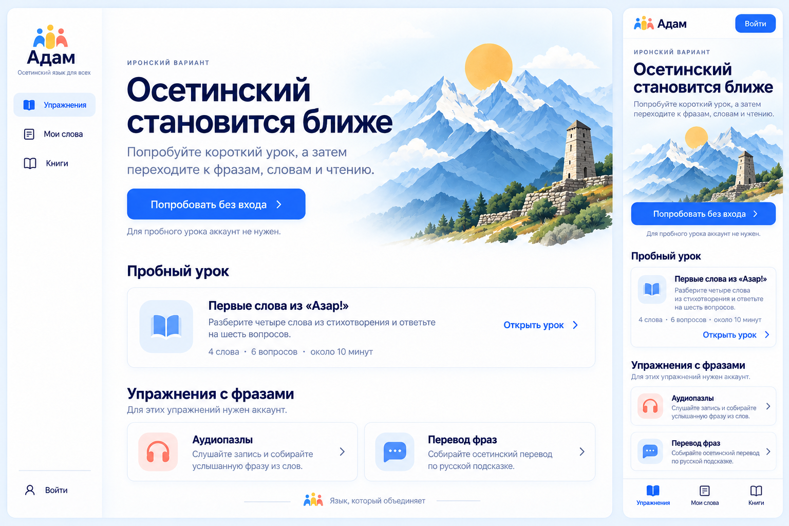
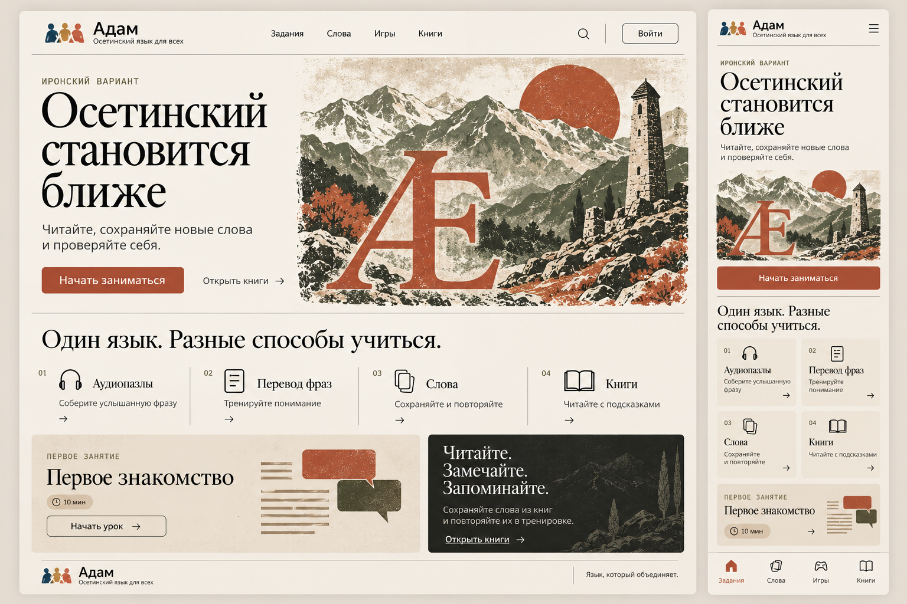

# «Адам» — сервис изучения осетинского

Адаптивный сайт на ASP.NET Core MVC и .NET 10. В `IronLanguage.slnx` два проекта: `IronLanguage.Web` (сайт и учебные правила) и `IronLanguage.Db` (PostgreSQL, EF Core, миграции, интерфейсы и реализации репозиториев).

## Концепция проекта

«Адам» — платформа для изучения осетинского языка, объединяющая интерактивные упражнения, авторские курсы и чтение материалов. Проект развивается в направлении сервиса наподобие Puzzle English, но с собственными типами заданий и учебными материалами для осетинского языка.

В разделе упражнений планируется развивать уникальные тренажёры, а раздел курсов предназначен для авторских программ преподавателей языка.

Текущее техническое задание для уже работающих упражнений и чтения книг: [`EXERCISES_SPECIFICATION.md`](EXERCISES_SPECIFICATION.md).

Предложение по навигации, устранению повторяющихся переходов и готовым текстам всех страниц: [`UX_CONTENT.md`](UX_CONTENT.md). Документ разделяет текущие возможности и поведение, которое ещё нужно реализовать.

## Текущий интерфейс

В ветке `codex/design-green-current` зелёный дизайн перенесён на актуальную кодовую базу: адаптивная шапка, нижняя навигация на телефоне, иллюстрации и главная с переходами к аудиопазлам, переводу фраз и диалогам. Гостевые занятия сохранены; демонстрационные уроки и поиск по ним не возвращены. Шрифты Onest и Golos Text поставляются локально с открытыми лицензиями и поддержкой Ӕ/ӕ. Токены и правила оформления описаны в [DESIGN_SYSTEM.md](DESIGN_SYSTEM.md).

## Возможные варианты дизайна

Концепт главной страницы для компьютера и телефона: молочный фон, глубокий зелёный, тёплые акценты и иллюстрация с горами и буквой Ӕ. Основные действия — начать занятие, открыть книги, перейти к аудиопазлам, переводу фраз и словам.

Это возможные направления для обсуждения, а не утверждённый дизайн или уже реализованный интерфейс. Тексты и название занятия на макетах иллюстрируют композицию и не задают учебный контент.

### Вариант 1 — тёплый зелёный

В обновлённом макете убраны карточки «Слова» и «Книги» из блока «Как будем учиться» и надпись «Иронский вариант» над заголовком. В блоке остаются аудиопазлы и перевод фраз.



[Исходный макет](design/adam-home-concept.png) сохранён для сравнения. Цветовые версии ниже пока используют его прежнюю композицию.

#### Цветовая версия — синий

Та же композиция первого варианта с глубоким синим цветом кнопок, светло-голубыми заливками и холодными оттенками иллюстраций.



#### Цветовая версия — терракотовый

Та же композиция первого варианта с терракотовыми кнопками, тёплым молочным фоном и песочно-персиковыми заливками.



Следующие два концепта показывают альтернативные композиции, а не цветовые версии первого макета.

### Вариант 2 — светлый синий

Белый фон, синие акценты и боковая навигация на компьютере. Компактные карточки учебных форматов и отдельный блок первого занятия создают ощущение учебного кабинета.



#### Уточнение навигации и текстов

Версия с учётом замечаний: три учебных раздела, один вход на каждом экране, без повторных карточек слов и книг и без речевого пузыря над башней. Изображённый пробный урок относится к прежнему концепту: демонстрационный режим уроков удалён из сайта. Шрифты на растровом макете иллюстративны — при реализации нужен шрифт с проверенной поддержкой Ӕ/ӕ.



### Вариант 3 — книжный с терракотовыми акцентами

Бумажный фон, крупная типографика с засечками, тонкие разделители и иллюстрация в духе печатной графики. Вариант подчёркивает связь языка, чтения и культуры.



## Запуск

Требуются .NET SDK 10 и PostgreSQL. Создайте пользователя и базу `adam`, затем задайте строку подключения через `ConnectionStrings__Adam`. Пароль БД в репозиторий не записывайте.

```powershell
$env:ConnectionStrings__Adam = 'Host=localhost;Database=adam;Username=adam;Password=ВАШ_ПАРОЛЬ'
dotnet restore IronLanguage.Web/IronLanguage.Web.csproj
dotnet run --project IronLanguage.Web/IronLanguage.Web.csproj -- dictionary-import
dotnet run --project IronLanguage.Web/IronLanguage.Web.csproj
```

Команда `dictionary-import` применяет миграции, добавляет книгу «Азар!», загружает прилагаемый русско-осетинский словарь и заранее рассчитывает подсказки для сохранённых книг. Её можно повторить после замены `IronLanguage.Web/Data/ossetian-russian-dictionary.csv`: неизменённые значения сохраняют ID, а опубликованные книги остаются доступны до завершения обновления в одной транзакции.

Если глобальный NuGet.Config в ограниченной среде недоступен, перед командами задайте `$env:APPDATA = (Get-Location).Path` и используйте `dotnet restore IronLanguage.Web/IronLanguage.Web.csproj --configfile NuGet.Config`. Для первой установки пакетов нужен доступ к NuGet.org.

Применяйте миграции до запуска сайта. Загруженные записи сохраняются в `IronLanguage.Web/wwwroot/media`; ключи входа — в `IronLanguage.Web/.data-protection-keys`. При развёртывании подключите для них постоянные тома и включите медиа вместе с PostgreSQL в резервное копирование. Путь к ключам можно задать через `DataProtection__KeysDirectory`.

### Запуск из Visual Studio

Откройте `IronLanguage.slnx` в Visual Studio 2026 с компонентом «ASP.NET и веб-разработка» и SDK .NET 10. Назначьте `IronLanguage.Web` запускаемым проектом, выберите профиль `http` или `https` и нажмите F5. PostgreSQL должен быть запущен, а миграции — применены к выбранной базе.

Для запуска из Visual Studio без предварительного задания переменных окружения сохраните строку подключения в локальных User Secrets. В этом рабочем окружении выполните из корня проекта:

```powershell
. .\.run-local\connection.ps1
dotnet user-secrets set 'ConnectionStrings:Adam' "$env:ConnectionStrings__Adam" --project IronLanguage.Web/IronLanguage.Web.csproj
```

На другом компьютере задайте `ConnectionStrings:Adam` через «Управление секретами пользователя» у Web-проекта, указав свои host, port, database, username и password. User Secrets находятся вне репозитория и автоматически загружаются в режиме Development; это локальный инструмент разработки, а не зашифрованное хранилище production. Не записывайте пароль в `appsettings.json`, `launchSettings.json` или C#-файлы. Переменная `ConnectionStrings__Adam`, если задана, имеет приоритет над User Secrets. `AdamDbContextFactory` используется инструментами EF; изменение только его резервной строки не меняет подключение обычного Web-запуска.

## Содержание и редактор

После регистрации назначьте первого редактора через административный доступ к БД: `UPDATE "Users" SET "IsEditor" = true WHERE "Email" = 'editor@example.com';`. Выйдите и войдите снова, чтобы обновилась роль в cookie. Публичная регистрация никогда не выдаёт роль редактора.

Раздел `/editor` находится в профиле редактора. Сначала выберите слово, аудиопазл, перевод фразы, книгу или диалог. Каждому типу соответствует отдельная форма; черновик можно изменить, проверить в предпросмотре и опубликовать после подтверждения проверки текста, перевода и прав. Для аудиопазла обязательна запись в MP3, OGG или WAV. Слова для сборки фразы задаются по одному на строке, связанные словарные записи выбираются поиском. При вводе главы пробелы и пунктуация сохраняются, а слова из опубликованного словаря связываются автоматически; на любое слово можно нажать, чтобы проверить перевод и изменить связь. При сохранении книги система рассчитывает словарные подсказки; неуверенные совпадения отмечаются как возможные. Литературный перевод можно добавить отдельно. Диалог задаётся тремя текстовыми блоками — персонажи (`Имя | #цвет`), реплики (`Имя: текст`, строка `Ученик:` без текста — место для ответа) и ходы (`№ | choice/free | эталоны | варианты | порог | пропуск`); при сохранении проверяются структура, лимиты и запрет латиницы в авторских текстах.

Опубликованный материал меняется через отдельный черновик новой версии. До публикации ученики видят прежнюю версию, начатые попытки сохраняют свои условия. История версий доступна только для просмотра. При обновлении книги сохраняются ID неизменённых глав, а сохранённая позиция чтения корректируется при сокращении или удалении главы.

Демонстрационный режим уроков удалён. Главная содержит переходы к аудиопазлам, переводу фраз и диалогам; учебные разделы работают с опубликованными материалами. Курсы с последовательностью интерактивных задач отложены. Миграция добавляет книгу «Азар!» с предоставленным литературным переводом; словарные подсказки для неё рассчитываются при импорте. Для полноценного первого учебного набора по-прежнему нужны озвученные фразы, слова и другие тексты с подтверждёнными правами на публикацию.

## Сиды диалогов

Диалоги можно загрузить в базу из `IronLanguage.Web/Data/dialogues/dialogues.json` — того же формата, что форма редактора: `title`, `dialect`, `level`, `characters`, `lines`, `turns`.

```powershell
dotnet run --project IronLanguage.Web/IronLanguage.Web.csproj -- dialogue-check
dotnet run --project IronLanguage.Web/IronLanguage.Web.csproj -- dialogue-import редактор@example.com
```

`dialogue-check` только читает базу и показывает, что изменится. `dialogue-import` ищет диалог по точному названию: найденный обновляется через обычную схему версий (новая ревизия и публикация), отсутствующий создаётся и публикуется, совпадающий остаётся нетронутым. Повторный запуск не создаёт дублей. Обе команды применяют миграции, поэтому запускайте их на подготовленной локальной базе, а не как обычную проверку сборки.

Почта редактора нужна только когда импорт действительно что-то записывает; её роль должна быть выдана заранее (`UPDATE "Users" SET "IsEditor" = true ...`). Если сид совпадает с базой, команда завершается успешно и редактора не спрашивает.

## Функции

Все опубликованные учебные материалы доступны без входа: аудиопазлы, перевод фраз, диалоги, книги и слова. Гость может отвечать на задания, читать со словарными подсказками, тренировать опубликованные слова и подбирать пары. Прогресс, очки, история, слова и позиция чтения гостя не сохраняются в БД. Для личного словаря, прогресса и редактора требуется вход.

- `/audio-puzzles` — сборка услышанной осетинской фразы; при недоступной записи отправка ответа блокируется.
- `/translate` — сборка перевода по русской подсказке.
- `/vocabulary` — личный список сохранённых и доступных слов.
- `/word-practice` — повторение слов; `/game` — отдельная игра на подбор пар.
- `/books` — чтение размеченных текстов со словарными подсказками и необязательным литературным переводом. API позиции чтения существует, но управление сохранением места в текущей читалке не показывается.
- `/dialogs` — диалоговый тренажёр в формате чата: лента реплик, ответ выбором или своим текстом, подсказки после неудачных попыток и сводка. Возобновление сессии и история прохождений доступны после входа. После входа за первое завершение диалога в день (UTC) начисляются 10 очков.
- `/progress` — очки, серия дней и награды.

JSON API размещён в `/api/v1`. Все изменяющие запросы требуют CSRF-токен. Персональные записи доступны только после входа; гостевые ответы проверяются сервером без записи прогресса. Проверка ответов и начисление очков выполняются сервером. Повторная отправка ответа не начисляет очки снова; повторное прохождение одного упражнения в тот же день тоже не приносит новых очков. Дни активности считаются по UTC.

Гостевые условия упражнений и диалогов хранятся только в ограниченном кэше памяти сервера: до 30 минут бездействия и не более двух часов. Они изолированы случайным HttpOnly-cookie и удаляются при перезапуске сервера; после окончания срока задание нужно начать заново. Ответы проверяются по снимку опубликованной версии. Гостевой результат не переносится в аккаунт после входа. После перезагрузки или повторного открытия страницы гость начинает новое занятие; собранные плитки не восстанавливаются. Cookie гостя продлевается при запросах состояния; срок хранения каждого снимка остаётся прежним. При заполнении кэша старые состояния могут быть вытеснены; если новое занятие не удалось сохранить, сервер возвращает 503 с предложением повторить позже.
