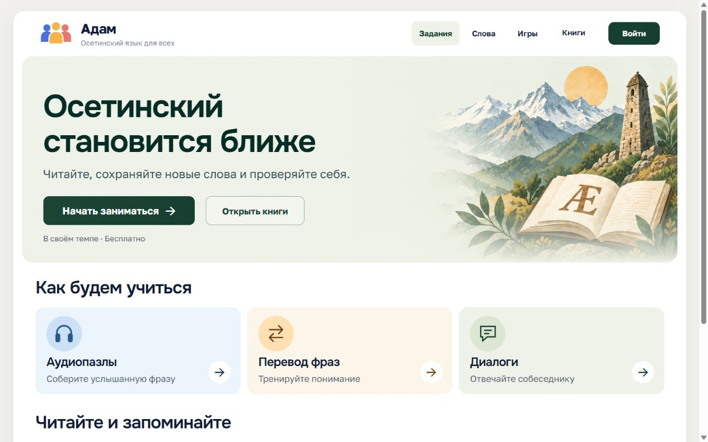

# Дизайн-система «Адам» — зелёная тема

Ветка `codex/design-green-current`. Единый стиль для главной и существующих разделов сайта: спокойная типографика, зелёные действия, светлые карточки и акварельные осетинские горы.

[Технические правила дизайн-системы](DESIGN_SYSTEM.md) · [Галерея макетов](docs/design/mockups-green-v1/index.html) · [Описание экранов](docs/design/mockups-green-v1/README.md)

## Палитра

| Назначение | Цвет |
| --- | --- |
| Фон / белая поверхность | #f1f0ec / #ffffff |
| Основной / вторичный текст | #101b34 / #526273 |
| Кнопки и активные элементы | #173f31 |
| Светлый зелёный | #eff2e8 |
| Аудиопазлы | #ecf4fc |
| Перевод фраз | #fcf5e9 |
| Видимый фокус | #286aab |

## Типографика и компоненты

Заголовки — **Onest**, основной текст — **Golos Text**. Шрифты размещены локально и поддерживают Ӕ/ӕ. Заголовки без засечек; контрастный текст и свободные интервалы сохраняются на узком экране.

Белая оболочка шириной до 1440 px; скругление оболочки 20 px, карточек 16 px, кнопок 10 px. Основные действия зелёные, вторичные — с тонкой обводкой. Иллюстрации плавно сходят к фону и не перекрывают текст.

«Задания», «Слова» и «Книги» ведут в разделы. На компьютере подменю появляются при наведении и доступны с клавиатуры, без отдельных стрелок. На телефоне используются общее меню и нижняя панель с зарезервированным местом под ней.

## Главная — текущий интерфейс

## Макеты разделов

Ниже — изображения для обсуждения дальнейшего оформления, а не скриншоты реализованных внутренних страниц. Учебные тексты представлены заполнителями. При переносе сохраняются текущие функции, гостевой режим и права доступа. Использовать оригинальные логотип и иконки из проекта; растровые начертания в макетах приблизительны.

### 1. Аудиопазлы и перевод фраз

### 2. Диалоги

### 3. Словарь, тренировка и подбор пар

### 4. Каталог и описание книги

### 5. Чтение и словарная подсказка

### 6. Вход, регистрация, профиль и результаты

### 7. Редактор: библиотека материалов

### 8. Редактор: формы и публикация

### 9. Навигация и служебные состояния

