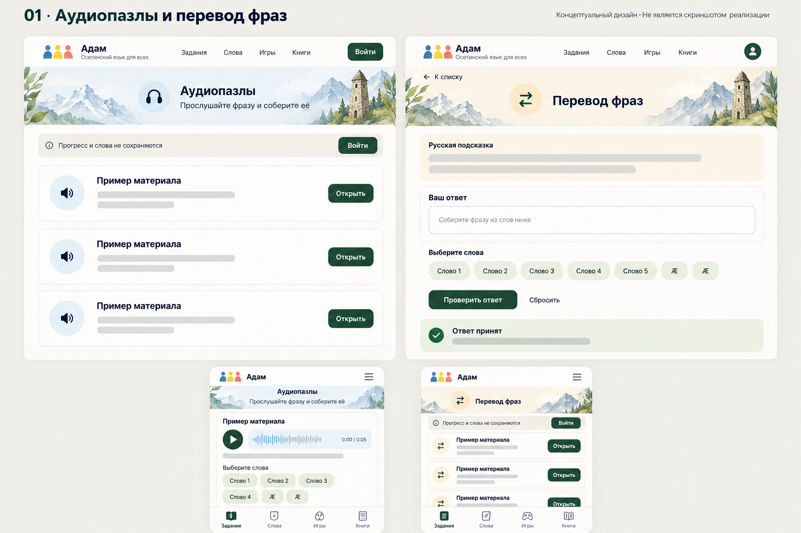
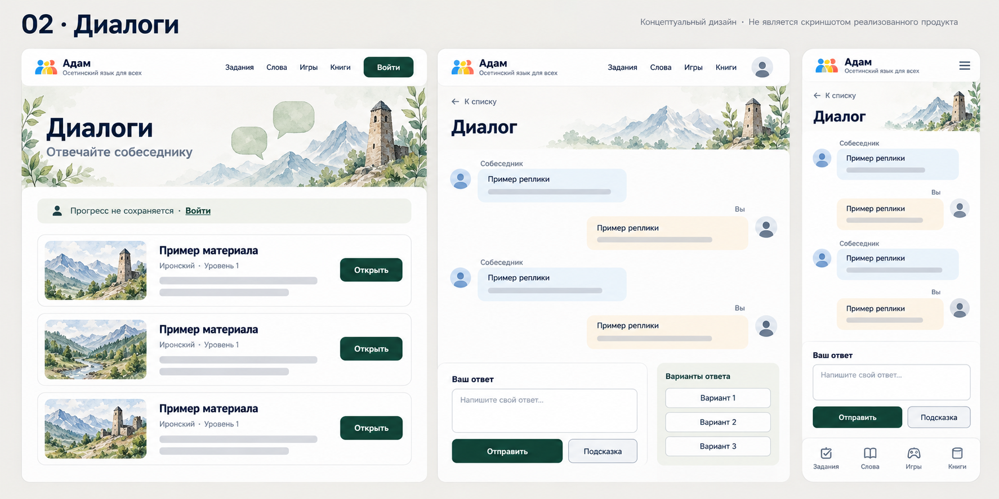
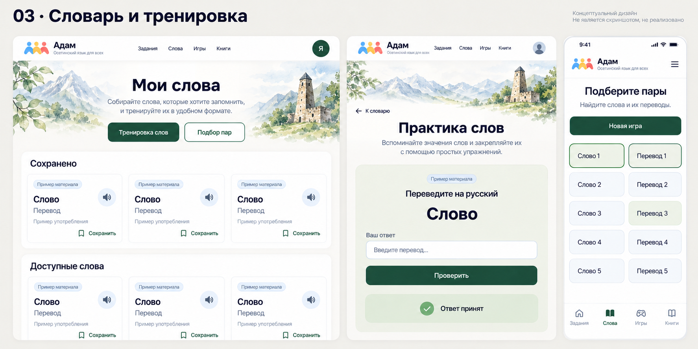
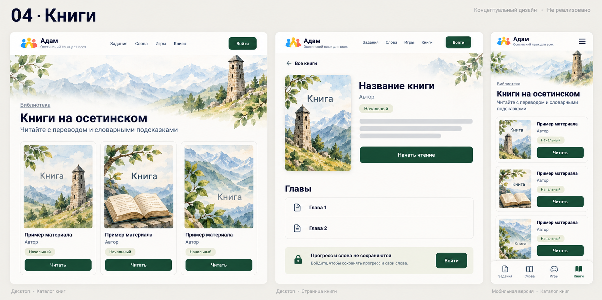
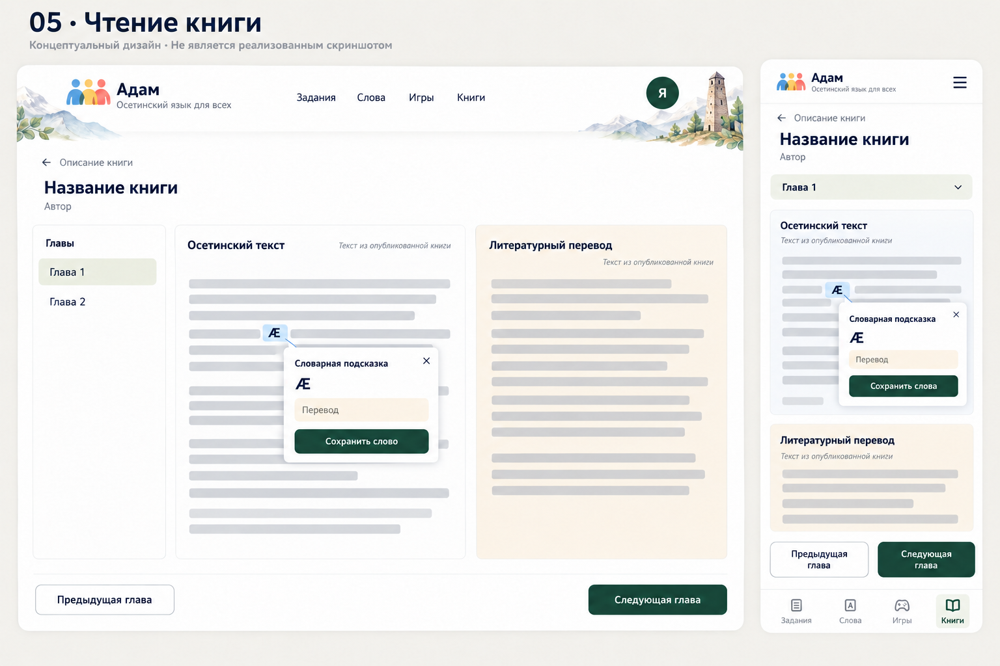
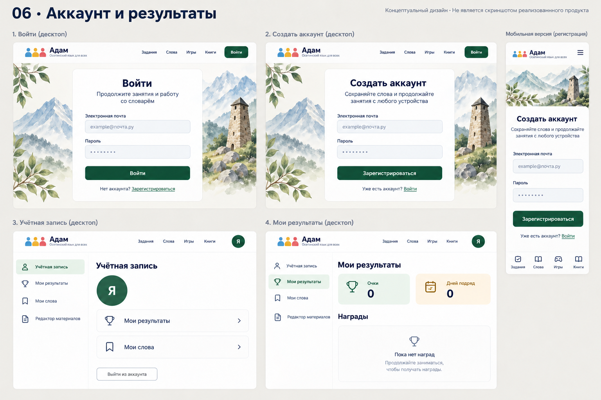
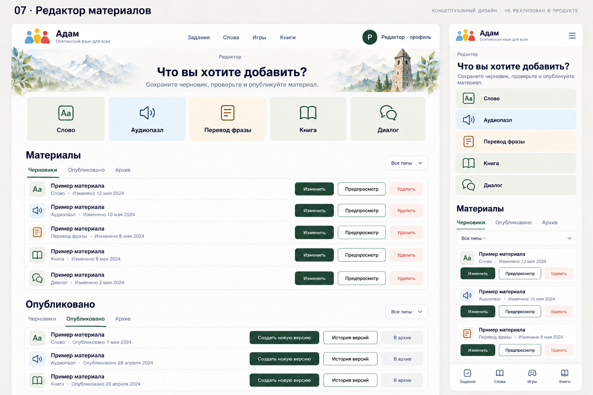
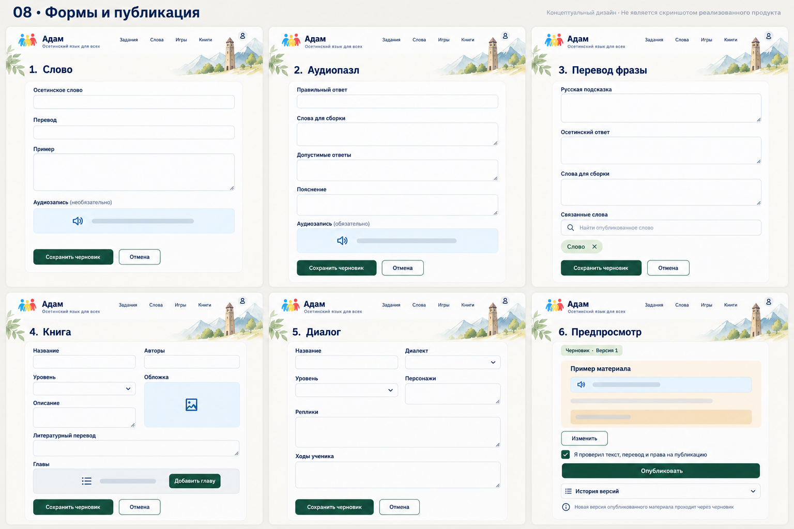
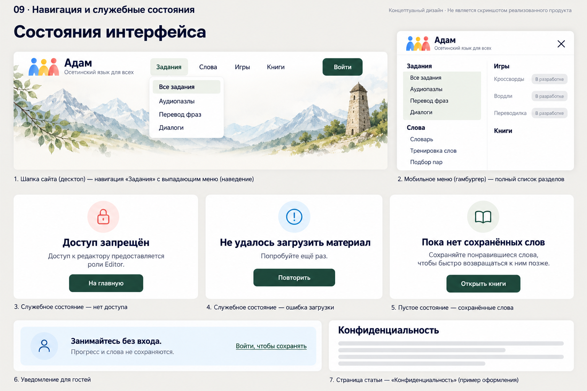

# Макеты разделов «Адам» — зелёная тема

8 октября 2026 года. Девять растровых концептуальных листов для обсуждения оформления существующих разделов в стиле обновлённой главной. Созданы встроенным инструментом imagegen. Это макеты, перенос оформления в страницы разделов ещё не выполнен.

[Открыть галерею](index.html) · [Промпты и уточнения](PROMPTS.md)

| Лист | Экраны | Маршруты |
| --- | --- | --- |
| [1. Аудиопазлы и перевод фраз](01-exercises.png) | Аудиопазлы и перевод фраз | /audio-puzzles, /translate |
| [2. Диалоги](02-dialogues.png) | Диалоги | /dialogs |
| [3. Словарь, тренировка и подбор пар](03-vocabulary.png) | Словарь, тренировка и подбор пар | /vocabulary, /word-practice, /game |
| [4. Каталог и описание книги](04-books.png) | Каталог и описание книги | /books |
| [5. Чтение и словарная подсказка](05-reader.png) | Чтение и словарная подсказка | /books: режим чтения |
| [6. Вход, регистрация, профиль и результаты](06-account.png) | Вход, регистрация, профиль и результаты | /account/login, /account/register, /profile, /progress |
| [7. Редактор: библиотека материалов](07-editor-library.png) | Редактор: библиотека материалов | /editor |
| [8. Редактор: формы и публикация](08-editor-forms.png) | Редактор: формы и публикация | /editor: формы пяти типов, предпросмотр и история |
| [9. Навигация и служебные состояния](09-states.png) | Навигация и служебные состояния | Шапка, мобильное меню, гостевой режим, ошибки, /Home/Privacy |

## Правила реализации

Основа — DESIGN_SYSTEM.md: Onest для заголовков, Golos Text для текста; белая оболочка, зелёный #173f31, светлые шалфейный, голубой и песочный фоны. Иллюстрации не мешают чтению. Использовать исходные логотип и SVG-иконки из репозитория: в растровых концептах их начертание приблизительное.

Тексты и переводы в макетах — обозначенные заполнители. Реальный контент брать только из опубликованных материалов. Растровое изображение Ӕ/ӕ не подтверждает поддержку кодовых точек шрифтом: проверять U+04D4/U+04D5 в браузере. При реализации сохранять контент, CSRF, гостевой режим и проверку ответов сервером.

«Мои слова», сохранение слова, профиль и результаты относятся к вошедшему пользователю. Для гостей название — «Словарь», сохранение требует входа, уведомление о несохранении прогресса остаётся видимым. Редактор и ссылка на него доступны только роли Editor. Не показывать пароль в профиле.

Названия разделов являются ссылками; подменю появляются при наведении и доступны с клавиатуры, без отдельных стрелок. На телефоне подразделы видны в открытом общем меню. Под нижней панелью резервируется место; срезы длинных страниц на листах не означают допустимое перекрытие кнопок.

В листах редактора состояния черновиков и публикаций показаны рядом для сравнения: в приложении переключение выполняют существующие вкладки. Сохранять поля существующих форм, предварительную проверку и публикацию новой версии через черновик. Декоративные детали, примерные даты, обложки и расположение карточек не являются новыми функциями. Для книги литературный перевод показывается только при наличии.

Макеты не заменяют проверку адаптивности реализованного интерфейса. Галерея служит просмотром изображений; серверные правила, API и схема БД этой задачей не менялись.

## 1. Аудиопазлы и перевод фраз

## 2. Диалоги

## 3. Словарь, тренировка и подбор пар

## 4. Каталог и описание книги

## 5. Чтение и словарная подсказка

## 6. Вход, регистрация, профиль и результаты

## 7. Редактор: библиотека материалов

## 8. Редактор: формы и публикация

## 9. Навигация и служебные состояния

## Проверка

Все изображения просмотрены после генерации; уточнены состояния входа, профиль и поля редактора. Макеты не использовались для замены учебных материалов. Для изменения общей навигации сборка решения прошла без ошибок и предупреждений; node --check nav.js прошёл. В работающем сайте проверены переход в словарь, ArrowDown, Escape и мобильное меню при 406 px. Наведение мышью и состояние с реальным входом в этой задаче вручную не проверялись.
